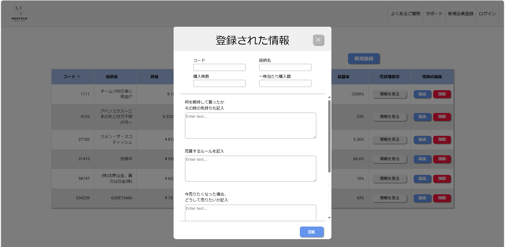

# 株式投資支援アプリ 〜感情に流されないためのサポートツール〜

## 📌 概要
相場の急変や価格の下落によって感情的になり、損失を出してしまうという課題に対して、ユーザーが自ら定めた取引ルールを守り、冷静に判断できるようサポートする株式投資支援アプリです。

「今は売るべき？」「ルールを守るべき？」といった迷いに対して、事前に設定したルールと現在の価格状況を照らし合わせ、ユーザーの意思決定を補助します。

## 🧑‍💻 開発体制
- チーム制作（4人）
- **自分の担当：バックエンド開発（Go言語）**

## 🛠 技術スタック
- フロントエンド：React（またはHTML/CSS等）※チームメンバー担当
- バックエンド：Go（Echoフレームワーク）
- データベース：PostgreSQL
- その他：Docker（開発環境構築）

## 🧠 主な機能
- 取引ルールの登録（例：「10%下落したら売却」など）
- 現在の株価との照合によるアラート表示
- 感情ログの記録（「不安」「焦り」など）
- 取引履歴・判断の記録と可視化

## 🖼️ UIイメージ

